# Intelligent Urban Traffic Flow & Congestion Prediction System

An end-to-end spatial-temporal machine learning forecasting and urban analytics system predicting next-hour traffic probe flow on 24,938 individual road segments in New Delhi, evaluated against empirical persistence baselines with contextual city-level congestion analysis.

[](https://www.python.org/)
[](https://scikit-learn.org/)
[](https://xgboost.readthedocs.io/)
[](https://flask.palletsprojects.com/)
[](https://python-visualization.github.io/folium/)
[](LICENSE)

---

## 1. Overview

The **Intelligent Urban Traffic Flow & Congestion Prediction System** is a production-grade machine learning system designed to forecast road-level traffic dynamics across the New Delhi National Capital Region (NCR). Utilizing 11.97 million hourly traffic-probe records spanning 24,938 unique road segments, the pipeline ingests raw geographic vector data, performs leakage-controlled spatial-temporal feature engineering, and benchmarks linear, tree, and gradient-boosted models against empirical persistence baselines on an unseen chronological test split.

The primary machine learning objective is to forecast the **next-hour traffic probe flow** (`probe_count(t+1)`) for each individual road segment given only information available strictly prior to time `t+1`. In this system, `probeCount` is strictly treated as an empirical traffic-flow proxy (derived from connected GPS mobility and navigation devices) rather than an absolute physical vehicle census count.

To complement road-level machine learning predictions with macro urban context, the system incorporates aggregated city and urban benchmark metrics. This enables comparative congestion pattern analysis across morning and evening rush-hour regimes without fabricating ungrounded road-level congestion labels. The complete workflow is exposed via an interactive Flask and Folium spatial dashboard providing on-demand next-hour forecasting, visual diagnostics, and interactive road corridor exploration.

---

## 2. Key Results

| Metric | Result |
|---|---:|
| Road segments | 24,938 |
| Road-segment/hour records | 11,970,240 |
| Observation period | Aug 11 - 30, 2024 |
| Training observations (Aug 11 - 26) | 8,977,680 |
| Test observations (Aug 27 - 30) | 2,394,048 |
| Feature count | 24 |
| Best model | Random Forest Regressor |
| Test MAE | 17.8112 |
| Test RMSE | 36.2533 |
| Test R | 0.9683 |
| MAE improvement vs Lag-1 Persistence | 32.6% |

**Key Finding**: Random Forest achieved the top predictive performance on the 4-day unseen chronological test set, reducing Mean Absolute Error by **32.6%** compared to the strong Naive Lag-1 persistence baseline and outperforming both regularized linear models and XGBoost.

---

## 3. Problem Formulation

The system addresses a rolling one-step-ahead ($t \to t+1$) spatial-temporal forecasting task:

- **Inputs at time $t$**:
  - Temporal features (hour, day of week, day of month, rush-hour indicators, cyclical trigonometric encodings)
  - Road-segment physical attributes (speed limit, Functional Road Class, segment length)
  - Historical traffic-flow lags (`lag_1`, `lag_2`, `lag_3`, `lag_24`) computed strictly per segment
  - Out-of-sample historical segment statistics (training-split segment mean, standard deviation, 90th percentile, zero-traffic frequency)
- **Target at time $t+1$**:
  - `probe_count(t+1)` representing the next-hour traffic probe flow proxy for that road segment.
- **Prediction Horizon**:
  - Exact one-hour rolling window ($t \to t+1$).

Because traffic flow exhibits strong temporal auto-correlation and diurnal seasonality, standard random cross-validation introduces severe temporal data leakage. A strict chronological validation strategy is required to mirror real-world deployment, ensuring future observations are never visible during feature preparation or model fitting.

---

## 4. Dataset

The project utilizes the **New Delhi Traffic Probe Count & Analytics Dataset (2024)**, covering over 15,000 km of road infrastructure across Delhi NCR:

- **Temporal Coverage**: 20 consecutive days from August 11, 2024 to August 30, 2024 at 1-hour resolution.
- **Spatial Coverage**: 24,938 unique road segments with full line string coordinate geometries.
- **Scale**: ~598,512 records per day totaling **11,970,240 road-segment/hour observations**.
- **GeoJSON Feature Schema**:
  - `segmentId` / `newSegmentId`: Unique road segment identifiers.
  - `streetName`: Identified road corridor or street name.
  - `speedLimit`: Posted speed limit in km/h.
  - `frc`: Functional Road Class (values 1 through 6, ranging from major highways to local residential streets).
  - `distance`: Segment length in meters.
  - `segmentProbeCounts`: Array of 24 hourly probe counts mapping `timeSet` (2 to 25) to hour of day (0:00 to 23:00).
  - `geometry`: Road vector coordinates used to compute representative centroids.
- **Cultural and Seasonal Factors**: The dataset period encompasses the monsoon season and three major cultural dates: Independence Day (Aug 15), Rakshabandhan (Aug 19), and Janmashtami (Aug 26).
- **Storage Note**: Due to GitHub file size limits, the raw multi-gigabyte GeoJSON files are excluded via `.gitignore` and converted locally into partitioned Parquet datasets.

---

## 5. System Architecture

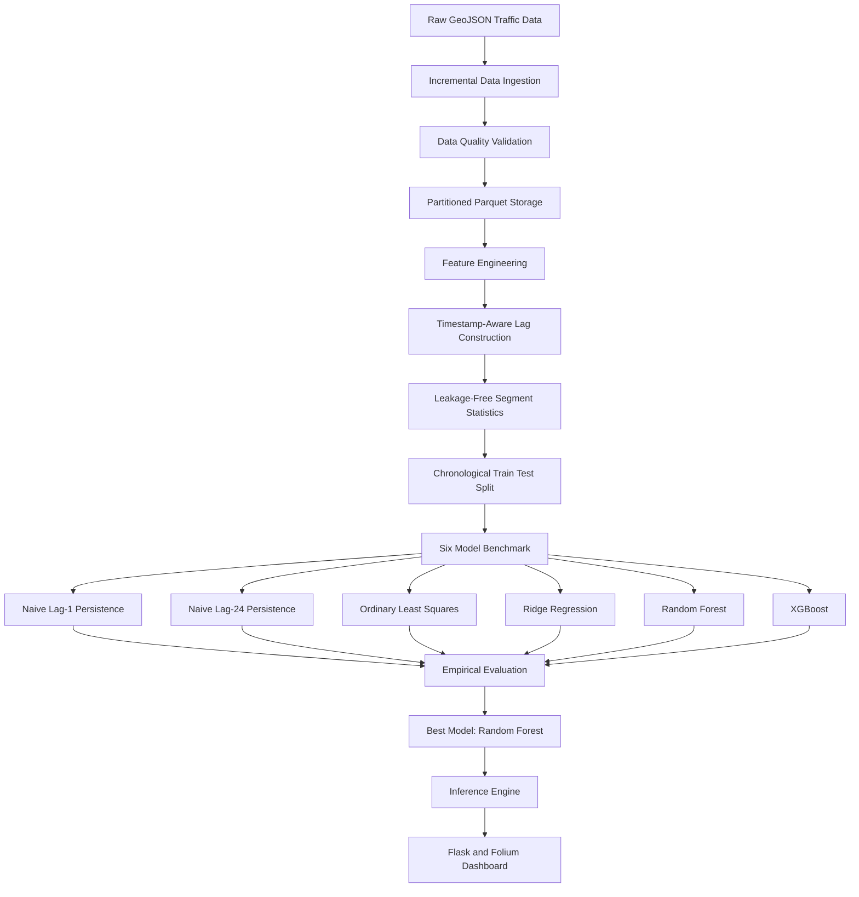

---

## 6. Data Engineering Pipeline

To process 11.97 million rows without memory exhaustion, the pipeline executes the following sequence:

1. **Incremental Daily Ingestion**: Daily GeoJSON files are ingested sequentially, flattening nested `segmentProbeCounts` arrays into tabular segment-by-hour rows.
2. **Timestamp Normalization**: Maps dataset `timeSet` indices (2 to 25) directly to 24-hour diurnal timestamps (0:00 to 23:00) with UTC/local alignment.
3. **Grid Completeness Verification**: Confirms every daily partition contains exactly 598,512 records (24,938 segments * 24 hours), ensuring an unbroken temporal grid.
4. **Data Quality Audit**: Audits missing values (0 found), duplicate segment-hours (0 found), coordinate completeness (100%), and zero-traffic proportions (8.06% legitimate low-volume roads).
5. **Partitioned Parquet Generation**: Writes snappy-compressed columnar Parquet files partitioned by `date=YYYY-MM-DD/` into `data/processed/`.
6. **Memory Efficiency**: Eliminates multi-gigabyte in-memory DataFrame overhead, enabling fast downstream loads and reproducible partition querying.

---

## 7. Feature Engineering

The feature vector comprises 24 standardized inputs structured across four categories:

### Temporal Features
- `hour`: Hour of day (0 to 23)
- `day_of_week`: Day index (0=Monday, 6=Sunday)
- `day_of_month`: Day of month (11 to 30)
- `is_weekend`: Binary flag for Saturday and Sunday
- `is_morning_rush`: Binary indicator for morning peak hours (8:00 to 10:00 AM)
- `is_evening_rush`: Binary indicator for evening peak hours (5:00 to 8:00 PM)
- `is_rush_hour`: Combined peak traffic flag
- `is_festival`: Indicator for major holiday dates (Independence Day, Rakshabandhan, Janmashtami)
- `hour_sin` / `hour_cos`: Trigonometric cyclical encodings for diurnal cycle continuity
- `dow_sin` / `dow_cos`: Trigonometric cyclical encodings for weekly cycle continuity

### Road Attributes
- `speed_limit`: Posted speed limit in km/h
- `frc`: Functional Road Class integer (1 to 6)
- `distance`: Segment length in meters

### Timestamp-Aware Lag Features
- `probe_count_lag_1`: Observed flow at exactly $t - 1\text{ hour}$
- `probe_count_lag_2`: Observed flow at exactly $t - 2\text{ hours}$
- `probe_count_lag_3`: Observed flow at exactly $t - 3\text{ hours}$
- `probe_count_lag_24`: Observed flow at exactly $t - 24\text{ hours}$ (same hour prior day)
- `probe_count_roll_mean_3h`: Moving average of the immediate prior 3 hours (`lag_1`, `lag_2`, `lag_3`)

*Note on Lag Integrity*: Lags are generated using an explicit `(segment_id, datetime)` grid sort. Technical validation confirmed that the implemented lag construction and segment historical statistics are aligned with the chronological evaluation design, ensuring exact second-level offsets ($\Delta t = 3600\text{s}, 7200\text{s}, 86400\text{s}$).

### Segment Historical Priors (Target Encoding)
- `segment_mean_traffic`: Mean historical flow per segment
- `segment_std_traffic`: Standard deviation of historical flow per segment
- `segment_p90_traffic`: 90th percentile traffic volume per segment
- `segment_zero_freq`: Frequency of zero-flow occurrences per segment

*Anti-Leakage Principle*: Raw numerical `segmentId` values are arbitrary identifiers without ordinal meaning. They are converted into continuous empirical priors computed **strictly on the August 11 - 26 training split** and merged out-of-sample onto the test set.

---

## 8. Train/Test Strategy

- **Training Split**: August 11, 2024 to August 26, 2024 (16 days - 8,977,680 records).
- **Test Split**: August 27, 2024 to August 30, 2024 (4 days - 2,394,048 records).

Random cross-validation is intentionally avoided because shuffling future traffic observations into training sets causes severe temporal leakage. The chronological partition strictly evaluates model performance on unseen future dates (Tuesday through Friday), evaluating real-world generalization across post-holiday weekday cycles.

---

## 9. Model Benchmark

Evaluation on the unseen 4-day chronological test split (2,394,048 samples):

| Model | Training Time | Test MAE | Test RMSE | Test R | Improvement vs Lag-1 |
|---|---:|---:|---:|---:|---:|
| Naive Lag-1 Persistence | 0.00s | 26.4178 | 51.9970 | 0.9349 | Baseline |
| Naive Lag-24 Seasonal | 0.00s | 24.9289 | 54.9575 | 0.9272 | -5.6% |
| Ordinary Linear Regression (OLS) | 3.15s | 21.8391 | 40.7394 | 0.9600 | +17.3% |
| Ridge Regression (L2-regularized linear regression) | 3.31s | 21.8391 | 40.7393 | 0.9600 | +17.3% |
| **Random Forest Regressor (Best)** | **118.79s** | **17.8112** | **36.2533** | **0.9683** | **+32.6%** |
| XGBoost Regressor (Histogram) | 111.55s | 18.3959 | 38.3657 | 0.9645 | +30.4% |

### Methodological Observations:
1. **Strong Persistence Baselines**: Naive Lag-1 establishes a competitive baseline ($R^2 = 0.9349$), reflecting high auto-correlation in hourly traffic flows.
2. **Linear Baseline Gain**: OLS and Ridge models reduce MAE from 26.42 to 21.84 (+17.3% improvement), verifying the additive value of road attributes and multi-scale lags.
3. **Ensemble Dominance**: Random Forest captures nonlinear interactions between diurnal rush-hour cycles and segment historical priors, achieving the lowest test MAE (**17.8112**) and highest $R^2$ (**0.9683**).

---

## 10. Model Evaluation & Diagnostics

Evaluation relies on three primary regression metrics:
- **Mean Absolute Error (MAE)**: Measures average magnitude of absolute forecast errors in probe units.
- **Root Mean Squared Error (RMSE)**: Penalizes larger forecast errors on high-volume corridors.
- **Coefficient of Determination (R)**: Quantifies the proportion of variance explained relative to a mean baseline.

### Diagnostic Visualizations Catalog

#### Traffic & Temporal Analysis
- 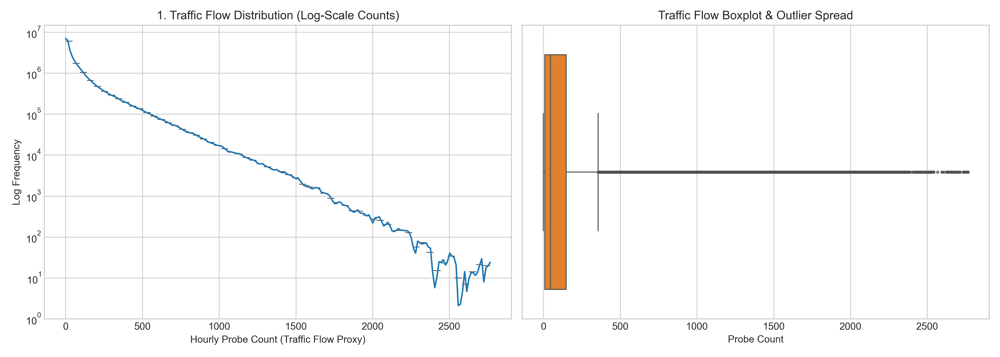
  *Figure 1: Distribution of probe flow proxy and outlier spread across 11.97M observations.*
- 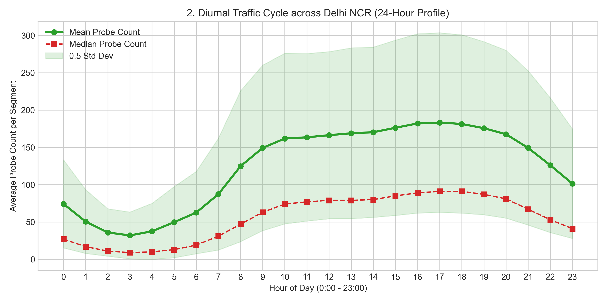
  *Figure 2: Diurnal 24-hour cycle showing morning (9 AM) and evening (6 PM) traffic peaks.*
- 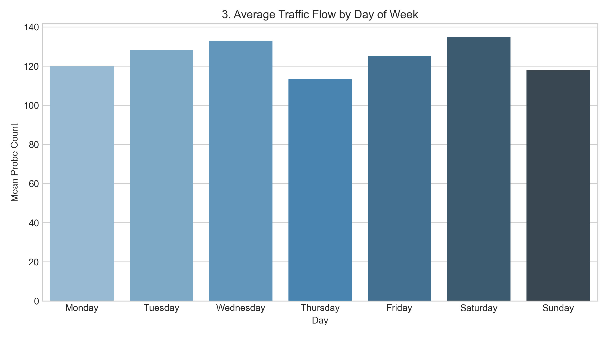
  *Figure 3: Mean traffic flow volume variation across days of the week.*
- 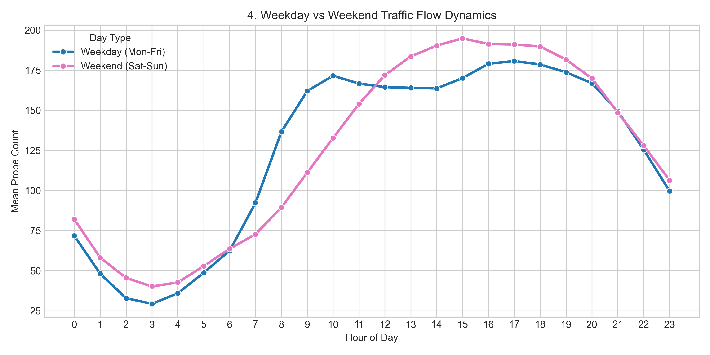
  *Figure 4: Comparison of commuter weekday peaks versus flattened weekend diurnal curves.*
- 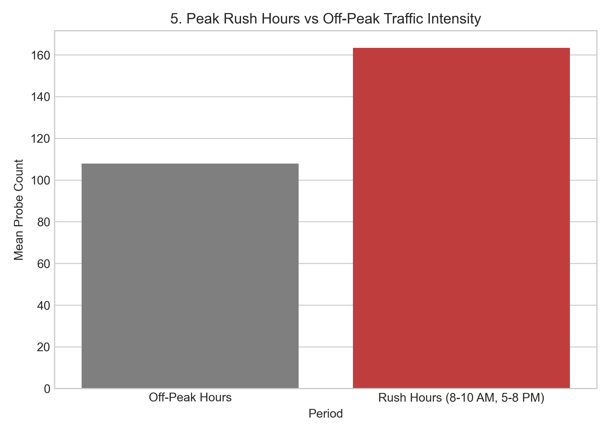
  *Figure 5: Traffic flow intensity during defined rush hours versus off-peak hours.*

#### Spatial & Road Characteristics
- 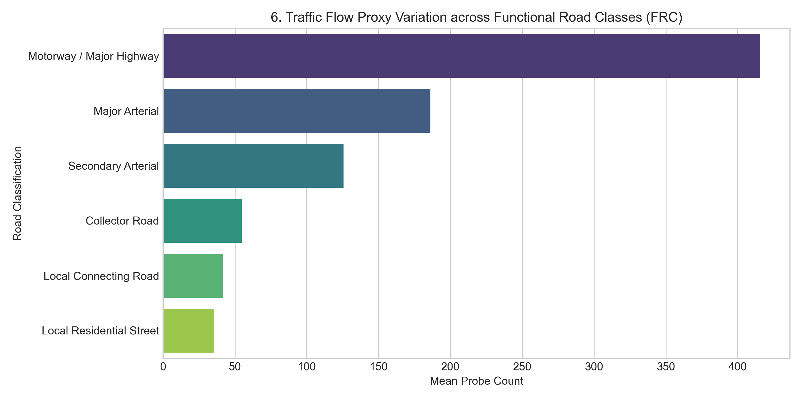
  *Figure 6: Mean flow hierarchy across Functional Road Classes (FRC 1 major motorways to FRC 6 residential).*
- 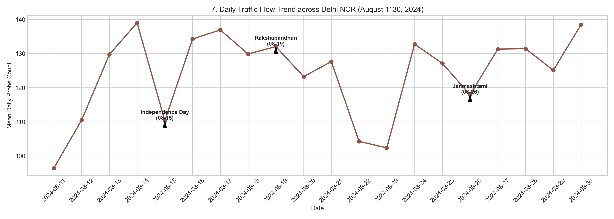
  *Figure 7: 20-day timeline annotating Independence Day, Rakshabandhan, and Janmashtami.*
- 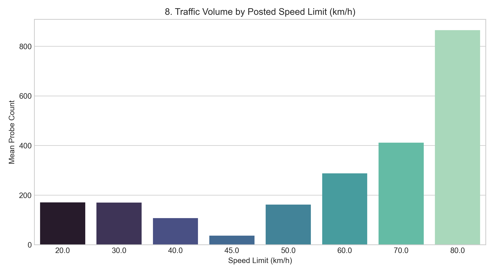
  *Figure 8: Observed traffic volume distribution across posted speed limit brackets.*
- 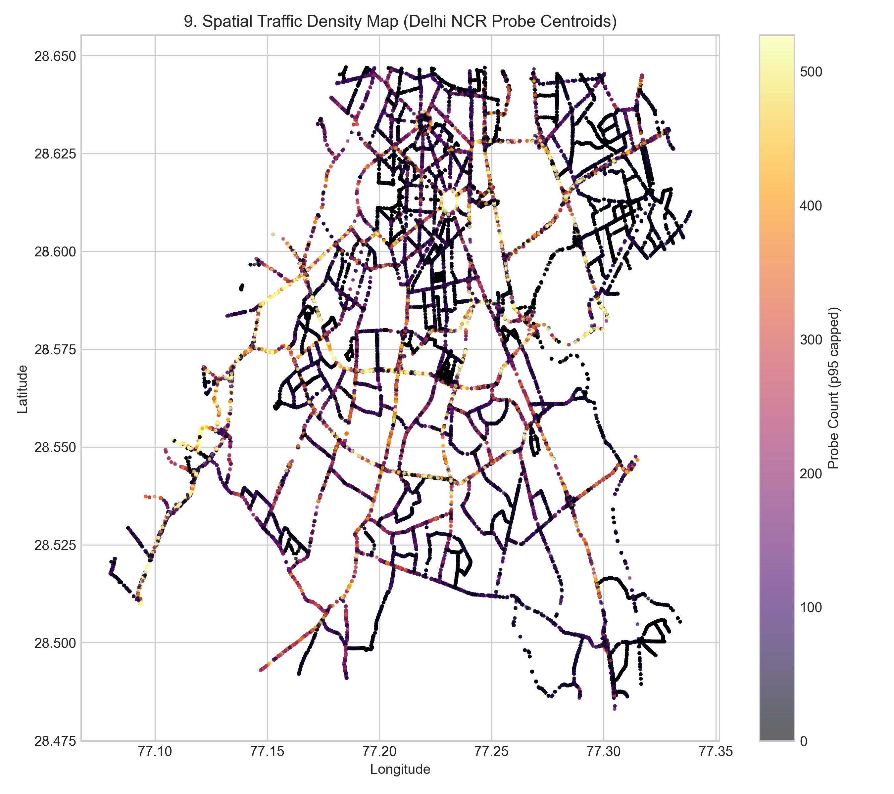
  *Figure 9: Geographic centroid density map of the 24,938 Delhi NCR road segments.*
- 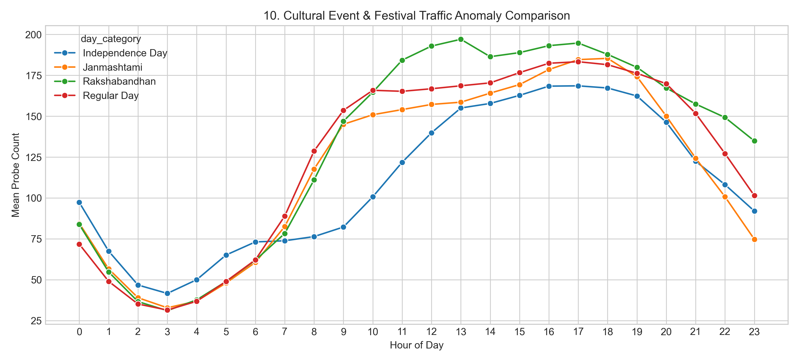
  *Figure 10: Comparison of hourly curves between cultural festival days and regular weekdays.*

#### Model Evaluation Diagnostics
- 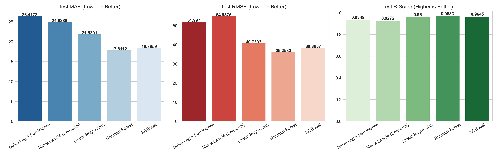
  *Figure 11: Benchmark comparison of Test MAE, RMSE, and R across the 6 evaluated models.*
- 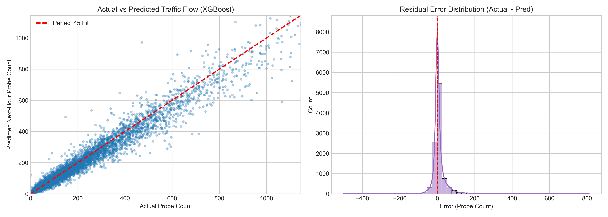
  *Figure 12: Actual vs Predicted 45-degree scatter plot and residual error distribution for Random Forest.*
- 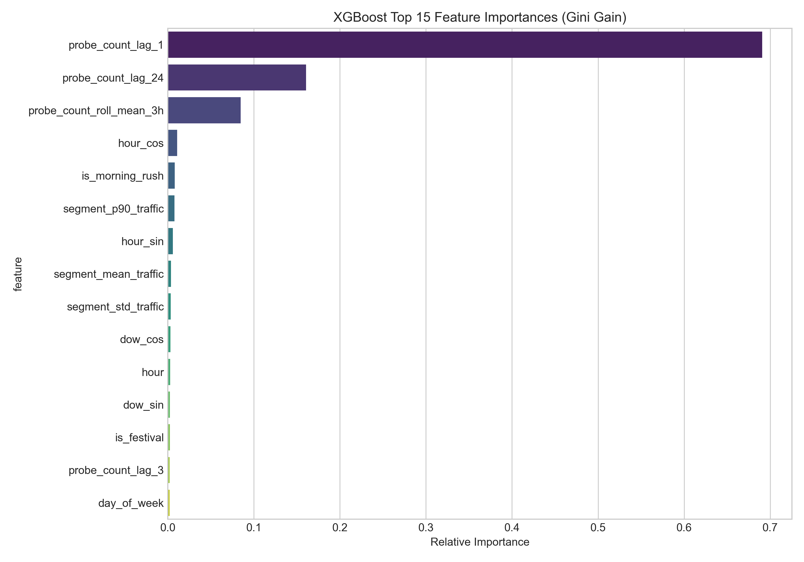
  *Figure 13: Gini gain feature importance ranking (top predictors: lag_1, segment_mean_traffic, lag_24).*

#### Congestion & Macro Analytics
- 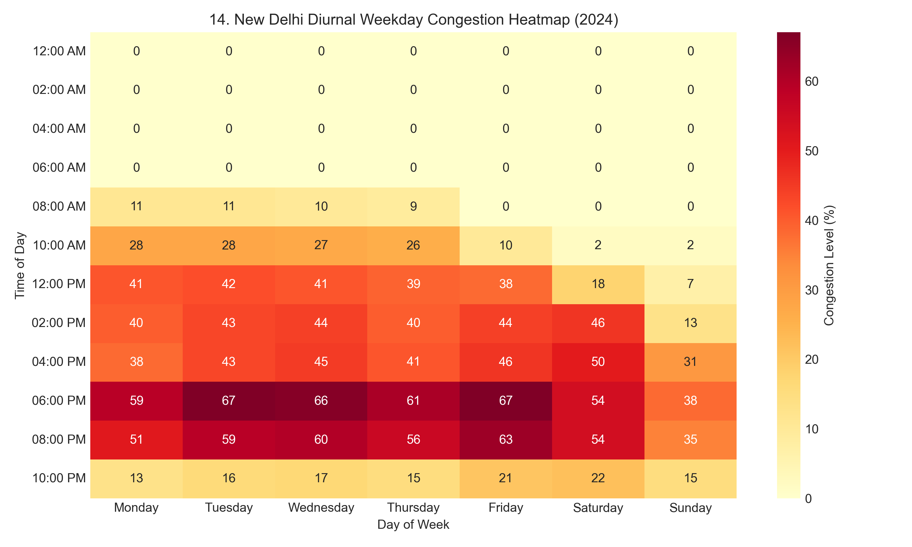
  *Figure 14: Hourly weekday congestion percentage heatmap across Monday through Sunday.*
- 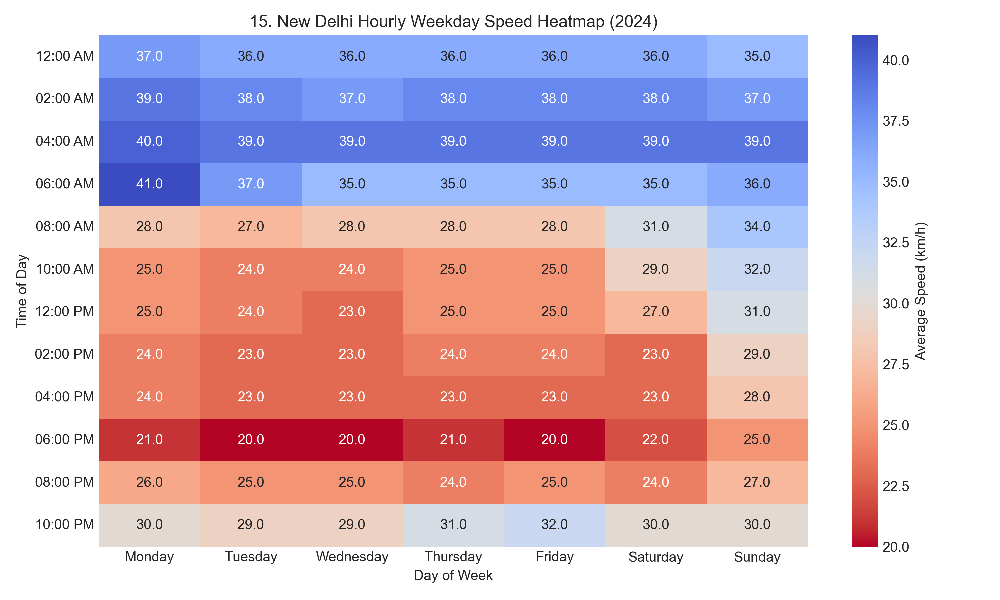
  *Figure 15: Average hourly vehicle speed degradation heatmap across days of the week.*
- 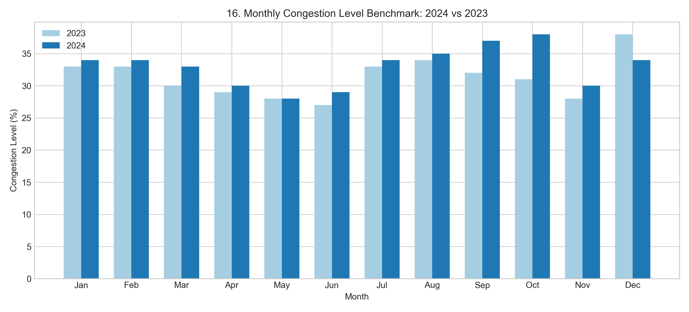
  *Figure 16: City-wide monthly congestion index benchmarking 2024 against 2023.*

---

## 11. Urban Congestion & Macro Traffic Analysis

Macro mobility insights derived from the supporting aggregated datasets:

- **Evening Rush Asymmetry**: Evening rush hours experience significantly greater congestion (**69%**) than morning rush hours (**43%**), accompanied by city-wide average speed dropping from **23.6 km/h down to 19.9 km/h** (-15.7% drop).
- **Diurnal Progression**: Congestion builds steadily from 10:00 AM (28%), reaching a sustained peak between 6:00 PM and 8:00 PM (67% weekday average) before dissipating after 10:00 PM.
- **Contextual Grounding**: These city-level statistics contextualize macro urban conditions without fabricating unverified road-level congestion labels.

---

## 12. Interactive Dashboard

The system includes a responsive Flask and Folium web application for **on-demand next-hour traffic forecasting**:

- **On-Demand Next-Hour Prediction**: Select any road segment, date, target hour, and model architecture to generate immediate forecasts with comparison against persistence baselines.
- **Model Switcher**: Allows toggling between Random Forest, XGBoost, Ridge, and OLS models with dynamic metric reporting.
- **Spatial Exploration**: Embedded Folium Leaflet map rendering Delhi NCR road corridors color-coded by average probe volume.
- **Performance Optimization**: Employs top-corridor sampling and pre-computed segment priors in memory for sub-100ms API response latency.

---

## 13. Project Structure

```
spatiotemporal-traffic-flow-forecasting/
├── src/
│   ├── config.py
│   ├── data_ingestion.py
│   ├── data_quality.py
│   ├── eda.py
│   ├── feature_engineering.py
│   ├── model_training.py
│   ├── model_evaluation.py
│   ├── congestion_analysis.py
│   └── prediction.py
│
├── dashboard/
│   ├── app.py
│   ├── templates/
│   │   └── index.html
│   └── static/
│       ├── css/
│       └── js/
│
├── notebooks/
│   └── traffic_flow_prediction_pipeline.ipynb
│
├── tests/
│   └── test_technical_audit.py
│
├── models/
│   └── trained model artifacts
│
├── visualizations/
│   └── diagnostic plots
│
├── docs/
│   ├── architecture.md
│   └── methodology.md
│
├── data/
│   ├── raw/
│   └── processed/
│
├── run_pipeline.py
├── requirements.txt
├── README.md
├── LICENSE
└── .gitignore
```

---

## 14. Quick Start

### 1. Clone the Repository
```bash
git clone https://github.com/sahajasakhunala/spatiotemporal-traffic-flow-forecasting.git
cd spatiotemporal-traffic-flow-forecasting
```

### 2. Set Up Virtual Environment & Dependencies
```bash
python -m venv .venv
source .venv/bin/activate  # On Windows: .venv\Scripts\activate
pip install -r requirements.txt
```

### 3. Run the Technical Verification Tests
```bash
python -m unittest discover -s tests -p "test_*.py"
```

### 4. Execute the End-to-End Pipeline (Optional)
```bash
python run_pipeline.py
```

### 5. Launch the Interactive Dashboard
```bash
python dashboard/app.py
```
Open **http://127.0.0.1:5000** in your browser to interact with the Next-Hour Predictor and Delhi NCR Traffic Map.

---

## 15. Limitations & Future Scope

1. **Probe Count Representation**: Probe counts capture connected GPS navigation devices, representing an empirical volume proxy rather than full physical sensor counts.
2. **Real-Time Streaming**: The pipeline performs on-demand inference over partitioned data; future work can integrate Kafka/Flink for live GPS telemetry streams.
3. **Spatial Graph Architectures**: Future iterations can implement Spatio-Temporal Graph Convolutional Networks (ST-GCN) or DCRNN to explicitly model topology-driven corridor spillover effects.

---

## 16. License & Citation

This project is licensed under the **MIT License** - see the [LICENSE](LICENSE) file for details.

If utilizing the underlying dataset, please cite:
> Ryan Madhuwala (RAW), *New Delhi Traffic Probe Count & Analytics Dataset (2024)*, Garudex Labs.

