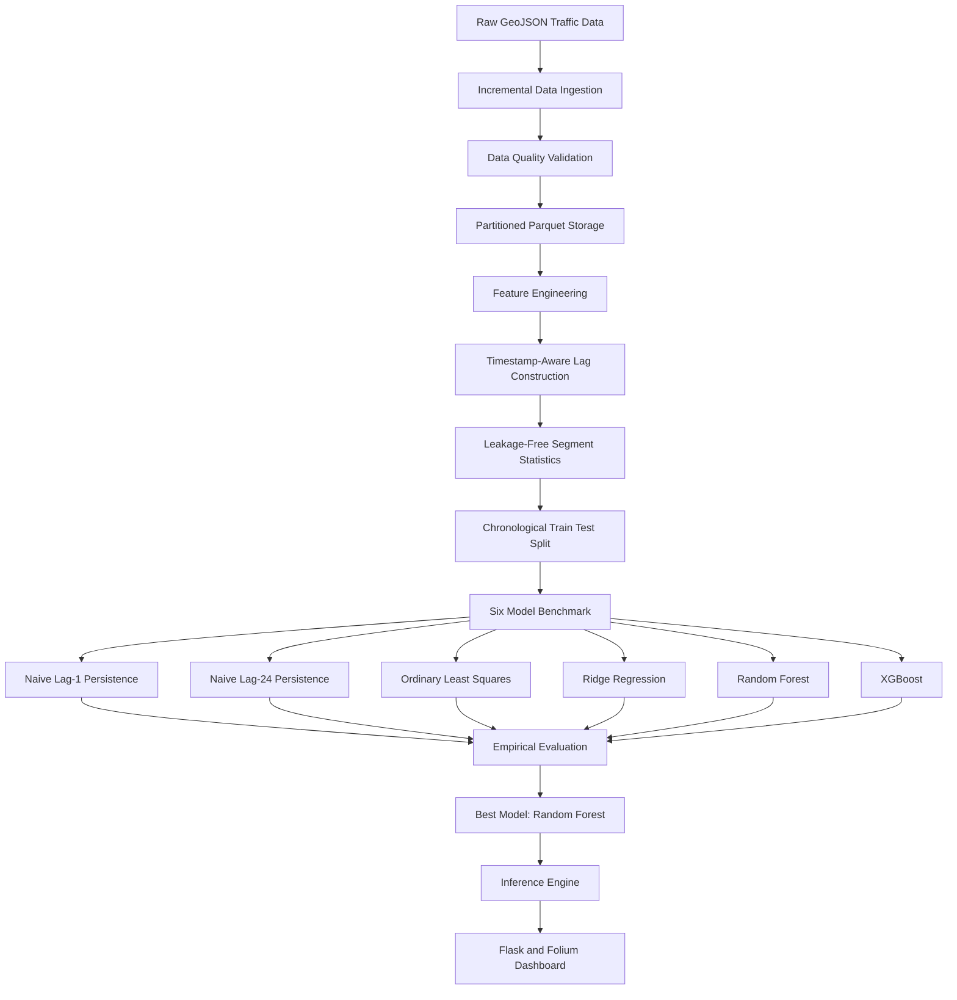

# Architecture & Data Flow Design

```mermaid
flowchart TD
    A["Raw GeoJSON Traffic Data"] --> B["Incremental Data Ingestion"]
    B --> C["Data Quality Validation"]
    C --> D["Partitioned Parquet Storage"]
    D --> E["Feature Engineering"]
    E --> F["Timestamp-Aware Lag Construction"]
    F --> G["Leakage-Free Segment Statistics"]
    G --> H["Chronological Train Test Split"]

    H --> I["Six Model Benchmark"]

    I --> J["Naive Lag-1 Persistence"]
    I --> K["Naive Lag-24 Persistence"]
    I --> L["Ordinary Least Squares"]
    I --> M["Ridge Regression"]
    I --> N["Random Forest"]
    I --> O["XGBoost"]

    J --> P["Empirical Evaluation"]
    K --> P
    L --> P
    M --> P
    N --> P
    O --> P

    P --> Q["Best Model: Random Forest"]
    Q --> R["Inference Engine"]
    R --> S["Flask and Folium Dashboard"]
```
